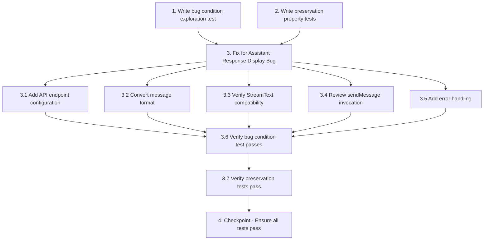

# Implementation Plan

## Overview

This implementation plan follows the exploratory bugfix workflow using the bug condition methodology. The workflow consists of three phases:

1. **Explore**: Write exploration tests BEFORE implementing the fix to understand the bug and surface counterexamples
2. **Preserve**: Write preservation tests to ensure existing behavior remains unchanged
3. **Implement**: Apply the fix with understanding from the exploration phase

The bug involves assistant responses failing to display in the chat UI despite successful API streaming. The root cause is likely a combination of missing API endpoint configuration in the useChat hook and message format incompatibility between the custom `parts` array format and the standard Vercel AI SDK message format.

## Tasks

- [ ] 1. Write bug condition exploration test
  - **Property 1: Bug Condition** - Assistant Response Display
  - **CRITICAL**: This test MUST FAIL on unfixed code - failure confirms the bug exists
  - **DO NOT attempt to fix the test or the code when it fails**
  - **NOTE**: This test encodes the expected behavior - it will validate the fix when it passes after implementation
  - **GOAL**: Surface counterexamples that demonstrate the bug exists
  - **Scoped PBT Approach**: For deterministic bugs, scope the property to the concrete failing case(s) to ensure reproducibility
  - Test that when the API returns 200 OK with streamed text data in toTextStreamResponse format, the useChat messages array is updated with a new assistant message containing visible text content
  - Test implementation details from Bug Condition in design:
    - Verify API response returns 200 OK status
    - Verify API response contains streamed data
    - Verify loading state transitions to complete
    - Assert that messages array contains new assistant message (THIS WILL FAIL on unfixed code)
    - Assert that assistant message has visible text content (THIS WILL FAIL on unfixed code)
  - The test assertions should match the Expected Behavior Properties from design:
    - useChat messages array SHALL be updated with assistant message
    - Assistant message SHALL contain streamed text content
    - Assistant message SHALL render as visible text bubble in chat UI
  - Run test on UNFIXED code
  - **EXPECTED OUTCOME**: Test FAILS (this is correct - it proves the bug exists)
  - Document counterexamples found to understand root cause:
    - Messages array does not contain assistant messages after API returns 200 OK
    - Tool results display in showcase but no assistant text in messages array
    - Possible causes: missing API endpoint config, message format incompatibility, streaming protocol mismatch
  - Mark task complete when test is written, run, and failure is documented
  - _Requirements: 1.1, 1.2, 1.3, 1.4_

- [ ] 2. Write preservation property tests (BEFORE implementing fix)
  - **Property 2: Preservation** - Non-Streamed Message Behavior
  - **IMPORTANT**: Follow observation-first methodology
  - Observe behavior on UNFIXED code for non-buggy inputs (interactions that don't involve receiving assistant text responses)
  - Write property-based tests capturing observed behavior patterns from Preservation Requirements:
    - User message display: Observe that user messages display immediately, write PBT to verify across message content variations
    - Loading indicators: Observe that loading states display correctly, write PBT to verify across loading state transitions
    - Tool showcase updates: Observe that product carousels, lookbooks display correctly, write PBT to verify across tool result types
    - Image upload workflow: Observe that image preview and upload works correctly, write PBT to verify across image types and sizes
    - Initial greeting: Observe that welcome message displays correctly, write PBT to verify with parts array format
    - Quick prompts: Observe that quick prompt buttons work correctly, write PBT to verify across prompt variations
  - Property-based testing generates many test cases for stronger guarantees
  - Run tests on UNFIXED code
  - **EXPECTED OUTCOME**: Tests PASS (this confirms baseline behavior to preserve)
  - Mark task complete when tests are written, run, and passing on unfixed code
  - _Requirements: 3.1, 3.2, 3.3, 3.4, 3.5, 3.6_

- [ ] 3. Fix for Assistant Response Display Bug

  - [ ] 3.1 Add API endpoint configuration to useChat hook
    - Open `app/(ai)/concierge/page.tsx`
    - Locate useChat hook initialization (around line 76)
    - Add `api: "/api/chat"` parameter to the hook configuration
    - Verify the endpoint path matches the actual route location
    - _Bug_Condition: isBugCondition(interaction) where API returns 200 OK with streamed data but messages array not updated_
    - _Expected_Behavior: useChat messages array SHALL be updated with assistant message containing streamed text_
    - _Preservation: User message display, loading indicators, tool showcases, image uploads, initial greeting must remain unchanged_
    - _Requirements: 2.1, 2.2, 2.3, 2.4, 3.1, 3.2, 3.3, 3.4, 3.5, 3.6_

  - [ ] 3.2 Convert initial message format from parts array to standard content format
    - Open `app/(ai)/concierge/page.tsx`
    - Locate the initial messages array passed to useChat (around line 76)
    - Convert message format from:
      ```typescript
      {
        id: "init-1",
        role: "assistant",
        parts: [{ type: "text", text: "...", state: "done" }]
      }
      ```
    - To standard AI SDK format:
      ```typescript
      {
        id: "init-1",
        role: "assistant",
        content: "Welcome. Your private styling suite is ready..."
      }
      ```
    - Update message rendering logic to handle standard `content` format
    - Ensure backward compatibility if needed for existing message display
    - _Bug_Condition: Message format incompatibility prevents useChat from merging streamed messages_
    - _Expected_Behavior: Standard message format allows proper streaming message updates_
    - _Preservation: Initial greeting message must continue to display correctly_
    - _Requirements: 2.2, 3.6_

  - [ ] 3.3 Verify StreamText response format compatibility
    - Open `app/api/chat/route.ts`
    - Review the `result.toTextStreamResponse()` implementation
    - Verify response headers and content-type match @ai-sdk/react v3 expectations
    - If compatibility issues exist, consider using `result.toDataStreamResponse()` instead
    - Add response header logging to help diagnose streaming issues
    - _Bug_Condition: Streaming protocol mismatch prevents useChat from consuming responses_
    - _Expected_Behavior: StreamText response format compatible with useChat v3_
    - _Preservation: Tool execution and showcase updates must remain unchanged_
    - _Requirements: 2.1, 2.2, 3.3_

  - [ ] 3.4 Review and verify sendMessage invocation pattern
    - Open `app/(ai)/concierge/page.tsx`
    - Review sendMessage calls at lines 207, 320, 323
    - Verify that `sendMessage({ text, files })` parameter format matches useChat v3 API
    - Check Vercel AI SDK v3 documentation for correct function signature
    - Adjust invocation pattern if needed to match expected interface
    - _Bug_Condition: SendMessage parameter mismatch could cause responses not to be properly linked_
    - _Expected_Behavior: Correct sendMessage invocation ensures proper message flow_
    - _Preservation: User message submission and file uploads must remain unchanged_
    - _Requirements: 2.1, 3.1, 3.4, 3.5_

  - [ ] 3.5 Add error handling for stream failures
    - Add error callback to useChat configuration
    - Log any message update failures to console for debugging
    - Provide user-friendly error feedback if streaming fails
    - Add error state to UI to indicate when responses fail to load
    - _Bug_Condition: Silent failures in streaming may hide actual errors_
    - _Expected_Behavior: Errors are surfaced and logged for diagnosis_
    - _Preservation: Existing error handling for other interactions must remain unchanged_
    - _Requirements: 2.1, 2.2, 2.3_

  - [ ] 3.6 Verify bug condition exploration test now passes
    - **Property 1: Expected Behavior** - Assistant Response Display
    - **IMPORTANT**: Re-run the SAME test from task 1 - do NOT write a new test
    - The test from task 1 encodes the expected behavior
    - When this test passes, it confirms the expected behavior is satisfied
    - Run bug condition exploration test from step 1
    - **EXPECTED OUTCOME**: Test PASSES (confirms bug is fixed)
    - Verify that:
      - useChat messages array is updated with assistant messages
      - Assistant messages contain streamed text content
      - Assistant messages render as visible text bubbles in chat UI
      - Tool results continue to display alongside assistant text
    - _Requirements: 2.1, 2.2, 2.3, 2.4_

  - [ ] 3.7 Verify preservation tests still pass
    - **Property 2: Preservation** - Non-Streamed Message Behavior
    - **IMPORTANT**: Re-run the SAME tests from task 2 - do NOT write new tests
    - Run preservation property tests from step 2
    - **EXPECTED OUTCOME**: Tests PASS (confirms no regressions)
    - Confirm all preservation tests still pass after fix:
      - User message display works correctly
      - Loading indicators display correctly
      - Tool showcase updates work correctly
      - Image upload workflow functions correctly
      - Initial greeting message displays correctly
      - Quick prompts work correctly
    - _Requirements: 3.1, 3.2, 3.3, 3.4, 3.5, 3.6_

- [ ] 4. Checkpoint - Ensure all tests pass
  - Run all tests to verify complete functionality
  - Verify bug condition test passes (assistant responses display)
  - Verify all preservation tests pass (no regressions)
  - Test the full chat flow manually:
    - Send a simple text query and verify assistant response appears
    - Trigger a tool call and verify both showcase and assistant text appear
    - Upload an image and verify assistant text describes results
    - Verify initial greeting displays correctly
    - Verify all user interactions work as expected
  - If any tests fail, investigate and address root cause
  - Ask the user if questions arise or if additional testing is needed

## Task Dependency Graph



```json
{
  "waves": [
    {
      "name": "Wave 1: Exploration and Preservation Testing",
      "tasks": ["1", "2"]
    },
    {
      "name": "Wave 2: Implementation",
      "tasks": ["3.1", "3.2", "3.3", "3.4", "3.5"]
    },
    {
      "name": "Wave 3: Validation",
      "tasks": ["3.6", "3.7"]
    },
    {
      "name": "Wave 4: Final Verification",
      "tasks": ["4"]
    }
  ]
}
```

## Notes

- **CRITICAL**: Task 1 (exploration test) MUST be completed BEFORE implementing the fix. The test should FAIL on unfixed code - this confirms the bug exists.
- **CRITICAL**: Task 2 (preservation tests) MUST be completed BEFORE implementing the fix. Tests should PASS on unfixed code - this captures baseline behavior to preserve.
- Follow the observation-first methodology for preservation tests: observe behavior on unfixed code, then write tests capturing that behavior.
- The exploration test from Task 1 encodes the expected behavior and will validate the fix when it passes after implementation.
- Do NOT write new tests in subtasks 3.6 and 3.7 - rerun the SAME tests from Tasks 1 and 2.
- Property-based testing is recommended for preservation checking to provide stronger guarantees across the input domain.
- The most likely fix involves adding `api: "/api/chat"` to useChat configuration and converting the initial message format from `parts` array to standard `content` string format.
